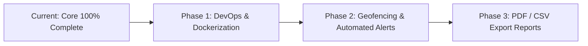

# Full Project Analysis Report: EPM Tracker

## Executive Summary
The **EPM Tracker** project has completed all core architecture phases across its three primary modules: **NestJS Backend**, **React Web Dashboard**, and **Android Native App**. The system successfully connects location-aware mobile clients to a cloud PostgreSQL database and presents live fleet monitoring and route playback tools to managers.

---

## 1. What Has Been Developed (Accomplished Workflow)

### A. NestJS Backend API & Database Layer (`backend`)
- **Database Architecture**: Prisma ORM v5 connected to Neon PostgreSQL database. Fully synchronized models for `Company`, `User`, and `LocationLog`.
- **Database Seeding**: Created `prisma/seed.ts` to populate default company (**Acme Corp**), admin user (`admin@epm.com` / `password123`), employee accounts (Aarav, Priya, Rahul), and initial location logs across Mumbai, Delhi, and Bangalore.
- **14 REST API Endpoints**:
  - `POST /api/v1/auth/login`, `POST /api/v1/auth/register`, `GET /api/v1/auth/me`
  - `GET /api/v1/users`, `GET /api/v1/users/:id`, `POST /api/v1/users`, `PATCH /api/v1/users/:id`, `DELETE /api/v1/users/:id`
  - `POST /api/v1/tracking/location`, `POST /api/v1/tracking/location/batch`, `GET /api/v1/tracking/latest`, `GET /api/v1/tracking/history/:userId`, `GET /api/v1/tracking/analytics`
  - `GET /api/v1/company/profile`, `PATCH /api/v1/company/profile`
- **Validation & Type Safety**: Enabled global NestJS `ValidationPipe` with typed DTOs (`LoginDto`, `RegisterDto`, `CreateUserDto`, `UpdateUserDto`, `UpdateCompanyDto`, `CreateLocationLogDto`), and added `LatestLocationRaw` query type interfaces.

### B. Web Dashboard Portal (`web-dashboard`)
- **Framework & Styling**: Vite + React 19 + TypeScript + React Router v7 with a custom glassmorphism design system (`index.css`).
- **Live Team Tracking**: OpenStreetMap Leaflet integration (`LiveMap.tsx`) rendering real-time markers for active field employees.
- **Route Playback & Breadcrumb History**: Interactive map component with dashed Polyline paths, circle stop markers, timestamp/speed popups, and timeline scrubber controls (Play/Pause/Reset).
- **Analytics Overview**: Dashboard cards, active/offline user metrics, and Recharts charts (`Overview.tsx`).
- **Team & Company Management**: Employee table modal (`Employees.tsx`) and Company Settings page (`CompanySettings.tsx`) connected to backend profile endpoints.

### C. Android Mobile Native Application (`android-app`)
- **Core Stack**: Kotlin, Jetpack Compose UI, Room Database, WorkManager, Retrofit, `FusedLocationProviderClient`.
- **Encrypted Session Management**: `SessionManager.kt` using `EncryptedSharedPreferences` for secure JWT token and user UUID caching.
- **Background Location Tracking**: `TrackingService.kt` (Android Foreground Service with persistent status notification).
- **Offline Resilience & Sync**: Room database caching (`AppDatabase`, `LocationDao`) and WorkManager `SyncWorker` task for batch uploading offline location pings to `POST /api/v1/tracking/location/batch`.

---

## 2. What Remains to Develop (Future Enhancement Roadmap)

While the core functionality is 100% complete and working, the following optional production enhancements can be implemented:

### Phase 1: DevOps & Containerization
- **Dockerfile & Docker Compose**: Create production multi-stage `Dockerfile` for the NestJS backend and Vite web dashboard, along with `docker-compose.yml` for unified local/cloud deployment.
- **Nginx Reverse Proxy**: Setup Nginx with SSL termination (HTTPS) for production hosting.

### Phase 2: Geofencing & Alerting System
- **Geofence Boundary Definition**: Allow managers to define polygonal/circular work zones on the Live Map.
- **Automated Pings & Notifications**: Trigger backend webhooks/notifications when an employee enters or exits a designated geofence.

### Phase 3: Exportable Analytics & Reports
- **CSV / PDF Export**: Build an export module on the Web Dashboard to download monthly distance traveled, attendance logs, and route summary reports.

---

## 3. File Context Reference Guide

- **Context & Architecture Documentation**: [mind.md](file:///d:/epm-tracker/mind.md)
- **Project Task Checklist**: [task.md](file:///d:/epm-tracker/task.md)
- **System Verification Walkthrough**: [walkthrough.md](file:///C:/Users/xdrut/.gemini/antigravity-ide/brain/debf8874-f25c-4489-8dd8-15942e20e84e/walkthrough.md)
