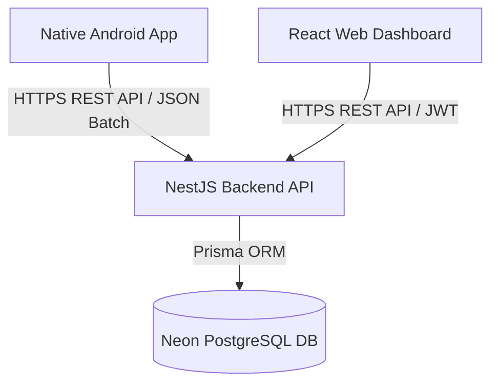

# EPM Tracker - System Mind Map & Architecture Context

## 1. Project Overview
**EPM Tracker** (Employee Performance & Presence Management Tracker) is an end-to-end multi-platform solution designed to track, monitor, and analyze field employee locations, movement breadcrumbs, and team productivity in real-time.

---

## 2. Architecture & Tech Stack

### Component Breakdown
| Layer | Framework / Library | Primary Responsibility |
| :--- | :--- | :--- |
| **Mobile App** | Kotlin, Jetpack Compose, Room, WorkManager, Retrofit | Background GPS tracking, offline caching, batch syncing, employee UI |
| **Backend API** | NestJS v11, Prisma ORM v5, JWT, Passport, Bcrypt | REST API server, authentication, business logic, PostgreSQL ORM |
| **Database** | Neon Cloud PostgreSQL | Persistent storage for Companies, Users, and Location Logs |
| **Web Dashboard** | React 19, Vite, Leaflet, Recharts, Lucide-React | Manager portal, live map tracking, route playback, analytics, settings |

---

## 3. Database Models (`prisma/schema.prisma`)

### `Company`
- `id`: String (UUID, PK)
- `name`: String
- `subscriptionPlan`: String (FREE, PRO, ENTERPRISE)
- `status`: Boolean (active/inactive)
- `createdAt`: DateTime

### `User`
- `id`: String (UUID, PK)
- `companyId`: String (FK -> Company.id)
- `role`: String (ADMIN, MANAGER, EMPLOYEE)
- `name`: String
- `email`: String (Unique)
- `passwordHash`: String
- `status`: Boolean (Active/Offline)
- `createdAt`: DateTime

### `LocationLog`
- `id`: String (UUID, PK)
- `companyId`: String (FK)
- `userId`: String (FK -> User.id)
- `latitude`: Float
- `longitude`: Float
- `accuracy`: Float
- `speed`: Float?
- `heading`: Float?
- `batteryLevel`: Int?
- `activityType`: String?
- `recordedAt`: DateTime

---

## 4. API Endpoints Suite (`/api/v1`)

### Authentication (`/api/v1/auth`)
- `POST /login` — Authenticate user credentials & return JWT access token.
- `POST /register` — Bootstrap company & admin user.
- `GET /me` — Retrieve currently logged-in user profile.

### User Management (`/api/v1/users`)
- `GET /` — List all team members.
- `GET /:id` — Fetch single user profile by ID.
- `POST /` — Create a new employee account.
- `PATCH /:id` — Update user details/role/status/password.
- `DELETE /:id` — Delete user account.

### Location Tracking (`/api/v1/tracking`)
- `POST /location` — Push single real-time location ping.
- `POST /location/batch` — Push batch of cached location logs (WorkManager).
- `GET /latest` — Get latest position for all active employees (Live Map).
- `GET /history/:userId` — Fetch historical breadcrumb logs for route playback.
- `GET /analytics` — Retrieve dashboard summary metrics (active/offline counts, daily logs).

### Company Management (`/api/v1/company`)
- `GET /profile` — Fetch company settings & plan info.
- `PATCH /profile` — Update company name & subscription tier.

---

## 5. Web Dashboard Pages & Features

1. **`Login.tsx`**: Admin & Manager authentication portal.
2. **`Overview.tsx`**: High-level dashboard with metric cards, Recharts activity charts, and recent events.
3. **`LiveMap.tsx`**:
   - OpenStreetMap (Leaflet) with live team markers.
   - **Route Playback & Breadcrumb History**: Interactive dashed Polyline path, breadcrumb stop markers, speed & timestamp popups, and timeline scrubber control bar (Play/Pause/Reset).
4. **`Employees.tsx`**: Employee list table with add/edit modals.
5. **`CompanySettings.tsx`**: Organization profile management, tier selector (Free, Pro, Enterprise), and system health status.

---

## 6. Native Android App Architecture

1. **`SessionManager.kt`**: Encrypted storage (`EncryptedSharedPreferences`) for JWT auth token & User UUID.
2. **`AppDatabase.kt` / `LocationDao.kt`**: Local Room database for caching offline GPS logs when network is unavailable.
3. **`TrackingService.kt`**: Android Foreground Service ensuring unbroken background location pings using `FusedLocationProviderClient`.
4. **`SyncWorker.kt`**: Periodic WorkManager task that batch uploads offline Room location logs to `POST /api/v1/tracking/location/batch`.
5. **`ApiClient.kt` / `ApiService.kt`**: Retrofit client pointing to backend REST API.
6. **Jetpack Compose UI**: `LoginScreen`, `DashboardScreen`, `PermissionScreen`.
