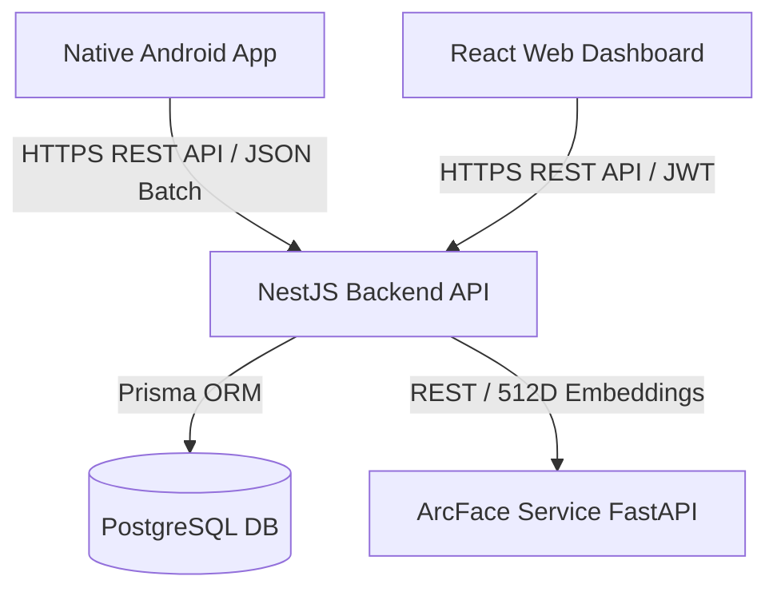

# EPM Tracker - System Mind Map & Architecture Context

## 1. Project Overview
**EPM Tracker** (Employee Performance & Presence Management Tracker) is an end-to-end multi-platform solution designed to track, monitor, and analyze field employee locations, movement breadcrumbs, and team productivity in real-time.

---

## 2. Architecture & Tech Stack

### Component Breakdown
| Layer | Framework / Library | Primary Responsibility |
| :--- | :--- | :--- |
| **Mobile App** | Kotlin, Jetpack Compose, Room, WorkManager, Retrofit, CameraX | Background GPS tracking, offline caching, batch syncing, front-camera silent capture, employee UI |
| **Backend API** | NestJS v11, Prisma ORM, JWT, Passport, Socket.io | REST API server, WebSockets gateway, authentication, business logic, PostgreSQL ORM |
| **Face Service** | Python, FastAPI, InsightFace, OpenCV | 512D ArcFace facial embedding extraction microservice |
| **Database** | Local / Cloud PostgreSQL | Persistent storage for Users, Profiles, Master lists, and Logs |
| **Web Dashboard** | React 19, Vite, Leaflet, Recharts, Lucide-React | Manager portal, live map tracking, route playback with RDP smoothing, telemetry stats, settings |

---

## 3. Database Models (`prisma/schema.prisma`)

### `WebUser`
- `id`: String (UUID, PK)
- `name`: String
- `email`: String (Unique)
- `passwordHash`: String
- `role`: String (ADMIN, MANAGER)
- `status`: Boolean (active/inactive)
- `createdAt`: DateTime

### `employees_master`
- `employee_code`: String (PK)
- `full_name`: String?

### `system_setup_table`
- `unique_id_no`: String (PK)
- `status`: String?
- `tracking_interval_minutes`: Int?
- `face_verification_interval_minutes`: Int?
- `face_verification_grace_period_minutes`: Int?

### `FaceProfile`
- `employee_code`: String (Composite PK -> `employees_master`)
- `device_id`: String (Composite PK)
- `registered_face_image`: String (Base64 JPEG)
- `registered_face_descriptor`: Float[] (512D ArcFace / 128D face-api.js vector)
- `registered_by`: String
- `registered_date_time`: DateTime
- `last_login_image`: String
- `last_login_date_time`: DateTime
- `login_status`: String ('Y'/'N')
- `delete_flag`: String ('Y'/'N')

### `LocationLog`
- `employee_code`: String (Composite PK -> `employees_master`)
- `latitude`: Float
- `longitude`: Float
- `recorded_date_time`: DateTime (Composite PK)
- `address`: String (Geocoded human-readable location)
- `accuracy`: Float

### `LoginLog`
- `employee_code`: String (Composite PK -> `employees_master`)
- `event`: String ('LOGIN' / 'LOGOUT')
- `latitude`: Float?
- `longitude`: Float?
- `date_time`: DateTime (Composite PK)

---

## 4. API Endpoints Suite (`/api/v1`)

### Authentication (`/api/v1/auth`)
- `POST /login` — Authenticate WebUser credentials & return JWT access token.
- `POST /register` — Register a WebUser.
- `POST /enroll-face` — Enroll a mobile user's face profile.
- `POST /verify-face` — Verify a mobile user's face against stored descriptor (for login/logout).
- `GET /me` — Retrieve currently logged-in web user profile.

### User Management (`/api/v1/users`)
- `GET /` — List all web users.
- `GET /:id` — Fetch single web user.
- `POST /` — Create a web user.
- `PATCH /:id` — Update web user.
- `DELETE /:id` — Delete web user.

### Location Tracking (`/api/v1/tracking`)
- `POST /location` — Push single real-time location ping.
- `POST /location/batch` — Push batch of cached location logs (from WorkManager).
- `POST /offline` — Explicitly mark an employee offline.
- `GET /latest` — Get latest position for all active employees (for Live Map).
- `GET /history/:employeeCode` — Fetch historical breadcrumb logs for route playback (supports `date` filter).
- `GET /config` — Retrieve dynamic tracking intervals configuration.
- `POST /config` — Update dynamic tracking config settings.
- `GET /analytics` — Retrieve dashboard summary metrics.

---

## 5. Web Dashboard Pages & Features

1. **`Login.tsx`**: Admin & Manager authentication portal.
2. **`Overview.tsx`**: High-level dashboard with metric cards, Recharts activity charts, and CSV report exports.
3. **`LiveMap.tsx`**:
   - OpenStreetMap (Leaflet) with live team markers via Socket.io.
   - **Route Playback & Breadcrumb History**: Interactive dashed Polyline path, breadcrumb stop markers with addresses, copy coordinates, and playback scrubber control bar.
   - **Google Maps 360° Street View**: In-modal virtual check.
4. **`Employees.tsx`**: Employee and hardware list with history logs modal.
5. **`CompanySettings.tsx`**: System configs updater (adjust ping intervals and face match rules).

---

## 6. Native Android App Architecture

1. **`SessionManager.kt`**: Encrypted storage (`EncryptedSharedPreferences`) for JWT auth token, active employee code, intervals, and verification states.
2. **`AppDatabase.kt` / `LocationDao.kt`**: Local Room database for caching offline GPS logs when network is unavailable.
3. **`TrackingService.kt`**: Android Foreground Service ensuring continuous location pings using `FusedLocationProviderClient`. Performs background CameraX captures for face verification and triggers buzzer sound alerts.
4. **`BackgroundCameraHelper.kt`**: silent camera captures utility using CameraX bound to ProcessLifecycleOwner.
5. **`SyncWorker.kt`**: Periodic WorkManager task that batch uploads offline Room location logs.
6. **`ApiClient.kt` / `ApiService.kt`**: Retrofit client pointing to backend REST API.
7. **Jetpack Compose UI**: `LoginScreen`, `DashboardScreen`, `PermissionScreen`, `FaceEnrollmentScreen`.
